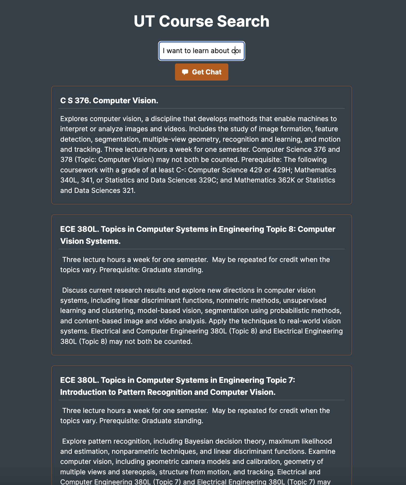
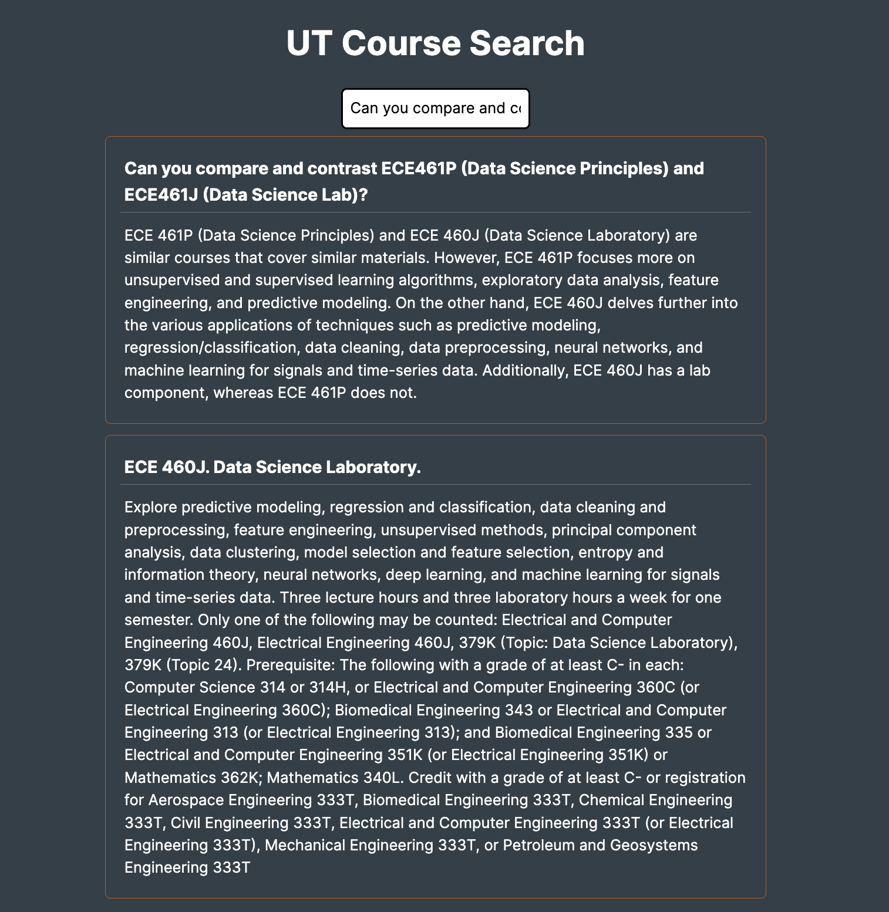

# ut_course_search
This repository contains a full stack application that allows students to search for courses they want to take at the University of Texas at Austin. The application leverages vector databases and OpenAI Embeddings so that natural language queries can be used to search for courses and specific course numbers or exact course titles are not needed. Students can query solely based on a topic they are interested in, and a list of courses relevant to that topic will be returned.

Example:

Query: "I want to learn about computer vision"



Additionally, the application leverages LlamaIndexing, which allows users to generate a chat-like response to their query if needed. This may be helpful if the user wants to compare and contrast two classes, or if the user does not want to read through the full list of courses returned by the query.

Example:

Query: "Can you compare and contrast ECE461P (Data Science Principles) and ECE461J (Data Science Lab)?"



A demo of this application can be found at this link: https://ut-course-search-5e5ddpxplq-uc.a.run.app/

## Local Setup
First, you will need to install Docker. If using Windows or macOS, you will want to download Docker Desktop from the following [link](https://docs.docker.com/get-docker/). If you are using WSL2, follow [these](https://docs.docker.com/desktop/windows/wsl/) instructions.

You will want to install conda as well if you have not already. You can find the appropriate installation link from this [link](https://docs.conda.io/en/latest/miniconda.html).

First, you will want to create a conda environment with the following command:
```
conda create -n ut_course_search python=3.8
```

Next, you will want to activate the environment with the following command:
```
conda activate ut_course_search
```

Next, you will want to clone the repository with the following command:
if you are using ssh:
```
git clone git@github.com:afnanmmir/ut_course_search.git
```
if you are using https:
```
git clone https://github.com/afnanmmir/ut_course_search.git
```

Next, navigate to the `ut_course_search_back` folder, and create a `.env` file. In this file, you will want to add the following lines:
```
OPENAI_API_KEY=<your openai api key>
PINECONE_API_KEY=<your pinecone api key>
PINECONE_ENV=<your pinecone environment name>
```

Navigate back to the root directory of the repository, and run the following command:
```
docker-compose up --build
```
This should run the application locally. You can access the application at `localhost:3000`.